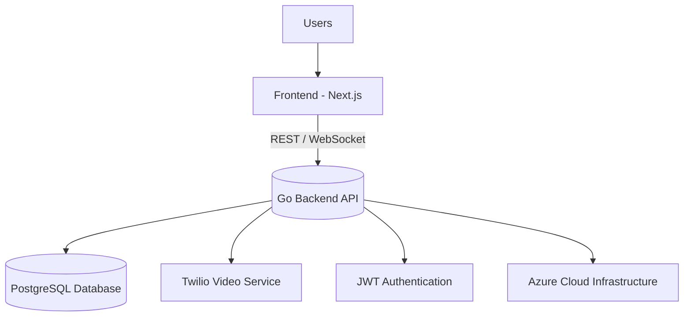

# 🌍 TechGetAfrica

**Empowering Africa's Digital Future**  
TechGetAfrica is a technology ecosystem connecting **African developers, innovators, and organizations** to build impactful solutions.  
Our mission is to **accelerate Africa's digital growth** through collaboration, innovation, and opportunity.


---

## 🏷️ Badges


---

## 🚀 Overview

TechGetAfrica is a **full-stack platform** that enables:
- 💼 Talent networking and job placement  
- 🧩 Collaboration and project management  
- 📚 Learning and mentorship programs  
- 💬 Real-time chat and Twilio-powered video calls  
- 🧠 Admin dashboards for control and analytics  

Built using **Next.js + Go + Azure**, TechGetAfrica delivers a powerful and scalable platform designed for real-world impact.

---

## 🧱 Architecture



---

## 🧩 Features

| Feature | Description |
|---------|-------------|
| 🔐 Authentication | Secure login, signup, and JWT sessions |
| 👤 Profiles | Manage personal, professional, and portfolio info |
| 💬 Communication | Real-time chat and video via Twilio |
| 📈 Dashboard | Dynamic metrics and system overview |
| 💡 Projects | Create and collaborate on projects |
| 🎓 Learning Hub | Training, mentorship, and course content |
| 🧑‍💼 Admin Panel | Manage users, projects, and analytics |
| 🌐 API Ready | REST + WebSocket communication for scalability |

---

## 🧰 Tech Stack

**Frontend:**
- Next.js 14
- React
- TypeScript
- Tailwind CSS
- Axios

**Backend:**
- Go (Golang)
- PostgreSQL
- GORM ORM
- Twilio Video API
- JWT Authentication

**DevOps:**
- Azure Cloud
- Nginx
- PM2
- Docker

---

## 📁 Folder Structure

```
techgetafrica/
├── app/
│   ├── page.tsx
│   ├── layout.tsx
│   └── components/
│       ├── Navbar.tsx
│       ├── Footer.tsx
│       └── Dashboard/
│           ├── Sidebar.tsx
│           ├── Stats.tsx
│           └── Cards.tsx
├── public/
│   ├── images/
│   └── icons/
├── styles/
│   └── globals.css
├── utils/
│   ├── api.ts
│   └── auth.ts
├── package.json
└── README.md
```

---

## ⚙️ Installation & Setup

### 1️⃣ Clone the Repository

```bash
git clone https://github.com/TechGetAfrica/techgetafrica.git
cd techgetafrica
```

### 2️⃣ Install Dependencies

```bash
npm install
# or
yarn install
```

### 3️⃣ Run Development Server

```bash
npm run dev
```

Then visit [http://localhost:3000](http://localhost:3000).

---

## 🔐 Environment Variables

Create a `.env.local` file in your root directory:

```bash
NEXT_PUBLIC_API_BASE_URL=https://api.techgetafrica.com
NEXT_PUBLIC_TWILIO_KEY=your_twilio_key
NEXT_PUBLIC_SOCKET_URL=wss://api.techgetafrica.com/ws
```

---

## 🏗️ Building for Production

```bash
npm run build
npm start
```

---

## ☁️ Deployment on Azure (Nginx + PM2)

### 1. SSH into your server

```bash
ssh user@your-server-ip
```

### 2. Clone, build, and start

```bash
git clone https://github.com/TechGetAfrica/techgetafrica.git
cd techgetafrica
npm install
npm run build
pm2 start npm --name "techgetafrica" -- start
pm2 save
pm2 startup
```

### 3. Configure Nginx

```nginx
server {
  listen 80;
  server_name techgetafrica.com www.techgetafrica.com;

  location / {
    proxy_pass http://localhost:3000;
    proxy_http_version 1.1;
    proxy_set_header Upgrade $http_upgrade;
    proxy_set_header Connection 'upgrade';
    proxy_set_header Host $host;
    proxy_cache_bypass $http_upgrade;
  }
}
```

### 4. Secure with SSL

```bash
sudo certbot --nginx -d techgetafrica.com -d www.techgetafrica.com
```

---

## 🧪 API Integration (Go Backend)

**Example Request:**

```typescript
import axios from "axios";

const API_URL = process.env.NEXT_PUBLIC_API_BASE_URL;

export const fetchProjects = async () => {
  const response = await axios.get(`${API_URL}/projects`);
  return response.data;
};
```

**Backend Repository:**  
[https://github.com/TechGetAfrica/backend](https://github.com/TechGetAfrica/backend)

---

## 🧭 Roadmap

- [x] Authentication system
- [x] Dashboard
- [x] Video call integration (Twilio)
- [x] Azure + Nginx deployment
- [ ] Chat & notifications
- [ ] AI-powered recommendations
- [ ] E-learning and mentorship modules
- [ ] Mobile app (React Native)

---

## 🤝 Contributing

We welcome developers across Africa and beyond 🌍

1. Fork this repo
2. Create a new branch: `git checkout -b feature/your-feature`
3. Commit your changes: `git commit -m "Added new feature"`
4. Push your branch: `git push origin feature/your-feature`
5. Submit a Pull Request 🚀

---

## 👥 Contributors

Thanks to these amazing people who make TechGetAfrica possible:

| Name | Role | GitHub |
|------|------|--------|
| Reagan Enoch | Founder & Lead Developer | [@reaganenoch](https://github.com/reaganenoch) |
| TechGetAfrica Team | Contributors | [@TechGetAfrica](https://github.com/TechGetAfrica) |

**Want to contribute?** Fork and add yourself to this list!

---

## 🧠 Learn More

- [Next.js Docs](https://nextjs.org/docs)
- [Go Docs](https://go.dev/doc/)
- [Twilio Video API](https://www.twilio.com/docs/video)
- [Azure Deployment Guide](https://docs.microsoft.com/en-us/azure/)

---

## 📞 Contact

**TechGetAfrica Team**  
🌍 [https://techgetafrica.com](https://techgetafrica.com)  
📩 contact@techgetafrica.com  
💬 [@TechGetAfrica](https://twitter.com/TechGetAfrica)

---

## 🪪 License

Licensed under the **MIT License**.  
See the [LICENSE](LICENSE) file for details.

---

**Built with ❤️ by the TechGetAfrica Team — advancing Africa's technology future.**
