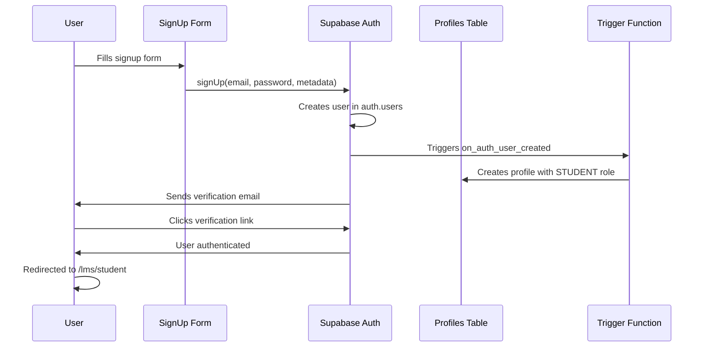

# Example Signup Flow - TechGetAfrica Supabase Integration

This document demonstrates how the new user signup flow works with automatic STUDENT role assignment.

## Complete Signup Flow

### 1. User Registration Process



### 2. Code Implementation

**SignUp Form Submission:**
```tsx
// User submits form with:
const formData = {
  email: "student@example.com",
  password: "securepassword",
  firstName: "John",
  lastName: "Doe",
  role: "STUDENT" // Default selected
}

// This calls:
await signUp(formData.email, formData.password, {
  firstName: formData.firstName,
  lastName: formData.lastName,
  name: `${formData.firstName} ${formData.lastName}`,
  role: formData.role
})
```

**Supabase Auth Response:**
```json
{
  "data": {
    "user": {
      "id": "123e4567-e89b-12d3-a456-426614174000",
      "email": "student@example.com",
      "email_confirmed_at": null,
      "user_metadata": {
        "firstName": "John",
        "lastName": "Doe",
        "name": "John Doe",
        "role": "STUDENT"
      }
    }
  }
}
```

**Automatic Profile Creation (via trigger):**
```sql
-- This happens automatically when user is created
INSERT INTO public.profiles (id, email, name, role)
VALUES (
    '123e4567-e89b-12d3-a456-426614174000',
    'student@example.com',
    'John Doe',
    'STUDENT'
);
```

### 3. Database State After Signup

**auth.users table:**
```
id: 123e4567-e89b-12d3-a456-426614174000
email: student@example.com
email_confirmed_at: null (until email verification)
user_metadata: {
  "firstName": "John",
  "lastName": "Doe", 
  "name": "John Doe",
  "role": "STUDENT"
}
```

**profiles table:**
```
id: 123e4567-e89b-12d3-a456-426614174000
email: student@example.com
name: John Doe
role: STUDENT
first_name: null (can be updated later)
last_name: null (can be updated later)
created_at: 2024-01-15 10:30:00
updated_at: 2024-01-15 10:30:00
```

## Role-Based Redirection

### After Successful Signup/Login:

```tsx
// middleware.ts handles redirection based on role
if (pathname === '/lms') {
  switch (profile.role) {
    case 'ADMIN':
      return NextResponse.redirect(new URL('/lms/admin', request.url))
    case 'INSTRUCTOR':
      return NextResponse.redirect(new URL('/lms/instructor', request.url))
    case 'STUDENT':
    default:
      return NextResponse.redirect(new URL('/lms/student', request.url))
  }
}
```

## Testing the Signup Flow

### 1. Manual Testing

```bash
# 1. Start your development server
npm run dev

# 2. Navigate to http://localhost:3000/auth/sign-up

# 3. Fill out the form:
# - Email: test@example.com
# - Password: testpassword123
# - First Name: Test
# - Last Name: User
# - Role: Student (should be pre-selected)

# 4. Submit form

# 5. Check Supabase dashboard:
# - Authentication > Users (should show new user)
# - Table Editor > profiles (should show new profile with STUDENT role)

# 6. Verify redirection to /lms/student
```

### 2. API Testing

```bash
# Test signup via API
curl -X POST http://localhost:3000/api/auth/signup \
  -H "Content-Type: application/json" \
  -d '{
    "email": "api-test@example.com",
    "password": "testpassword123",
    "firstName": "API",
    "lastName": "Test",
    "role": "STUDENT"
  }'
```

### 3. Database Verification

```sql
-- Check user was created in auth.users
SELECT id, email, user_metadata 
FROM auth.users 
WHERE email = 'test@example.com';

-- Check profile was created with STUDENT role
SELECT id, email, name, role, created_at 
FROM public.profiles 
WHERE email = 'test@example.com';
```

## Role Upgrade Example

### Admin Promoting Student to Instructor:

```tsx
// Admin API call to upgrade role
const response = await fetch('/api/admin/users/roles', {
  method: 'PUT',
  headers: { 'Content-Type': 'application/json' },
  body: JSON.stringify({
    userId: '123e4567-e89b-12d3-a456-426614174000',
    role: 'INSTRUCTOR'
  })
})

// Database update (with validation via trigger)
UPDATE public.profiles 
SET role = 'INSTRUCTOR', updated_at = NOW()
WHERE id = '123e4567-e89b-12d3-a456-426614174000';

// Audit log entry created automatically
INSERT INTO public.audit_logs (user_id, action, table_name, record_id, old_values, new_values)
VALUES (
  'admin-user-id',
  'role_change', 
  'profiles',
  '123e4567-e89b-12d3-a456-426614174000',
  '{"role": "STUDENT"}',
  '{"role": "INSTRUCTOR"}'
);
```

## Error Handling

### Common Signup Errors:

```tsx
// Email already exists
{
  "error": {
    "message": "User already registered"
  }
}

// Weak password
{
  "error": {
    "message": "Password must be at least 8 characters"
  }
}

// Invalid email format
{
  "error": {
    "message": "Invalid email address"
  }
}
```

## Security Features

### 1. Automatic Role Assignment
- New users always get STUDENT role by default
- Cannot be bypassed through form manipulation
- Enforced at database level via trigger

### 2. Role Change Protection
- Only ADMINs can change user roles
- Users cannot promote themselves
- All role changes are audited

### 3. Row Level Security
- Students can only see their own data
- Instructors can manage their courses
- Admins have full access

This signup flow ensures secure, automatic role assignment while maintaining flexibility for future role changes by administrators.